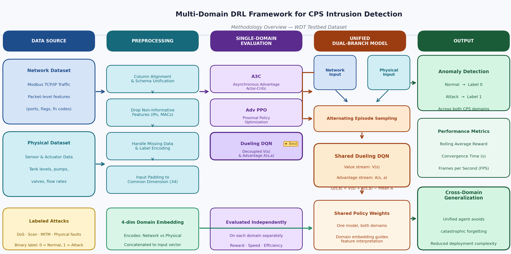
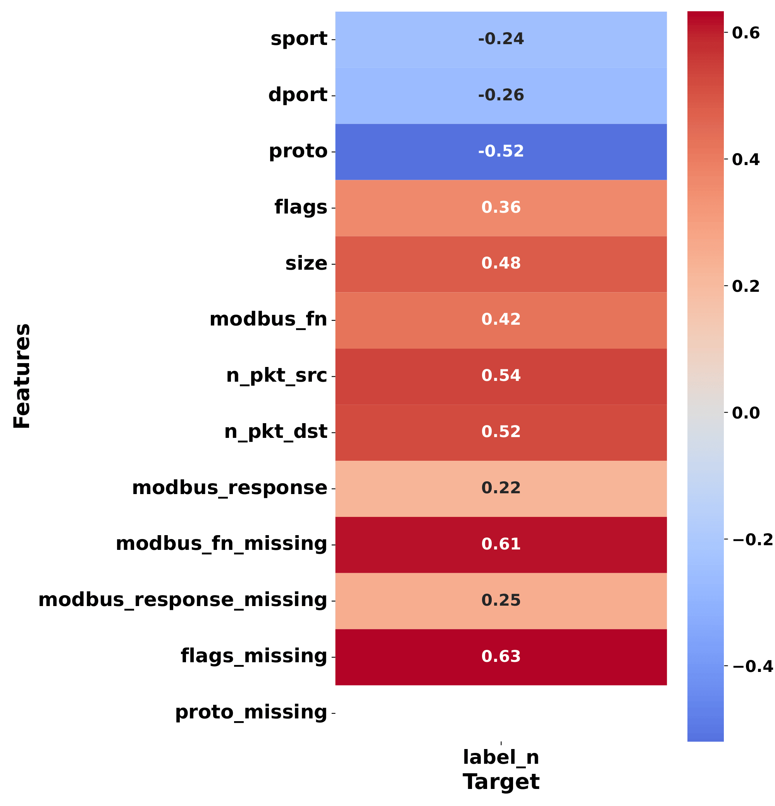
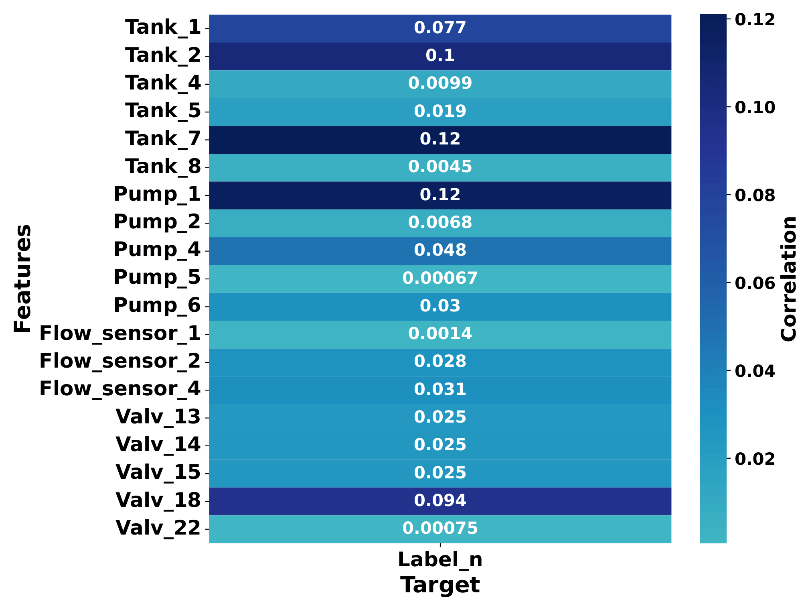
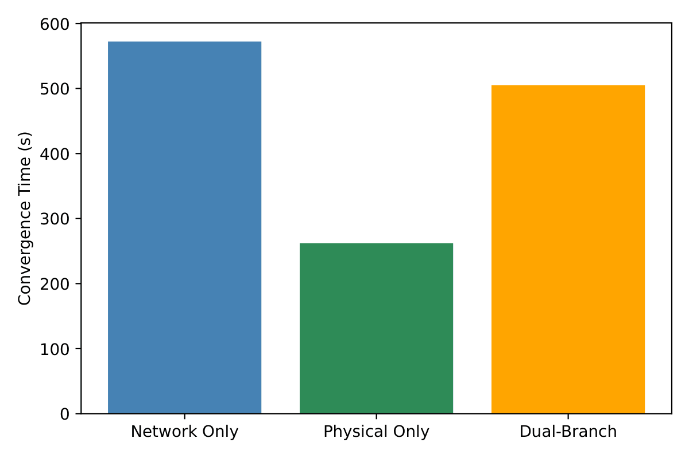

# Multi-Domain Deep Reinforcement Learning for Cyber-Physical Systems Security on the WDT Testbed Dataset

<a href="#"></a>
<a href="#"></a>
<a href="#"></a>
<a href="#"></a>
<a href="#"></a>
<a href="#"></a>
<a href="#"></a>
<a href="#"></a>
<a href="#"></a>

---

##  Project Highlights

- Evaluated three Deep Reinforcement Learning agents for CPS intrusion detection: **A3C**, **Adv PPO**, and **Dueling DQN**
- Benchmarked performance on both **network-layer** and **physical-layer** data from the **Water Distribution Testbed (WDT)** dataset
- Proposed a **unified dual-branch Dueling DQN** capable of learning across heterogeneous domains
- Introduced **input padding + domain embeddings** for shared policy learning
- Achieved strong generalization with a **rolling reward of 161.99** in the unified setting

---

## Abstract

Cyber-Physical Systems (CPS) are increasingly vulnerable to coordinated attacks targeting both the network and physical layers. Traditional intrusion detection systems typically treat these domains separately, limiting their ability to detect complex cross-domain threats.

In this work, we investigate whether a unified Deep Reinforcement Learning (DRL) agent can simultaneously detect anomalies across both domains using the **Water Distribution Testbed (WDT)** dataset.

We evaluate three DRL algorithms—**Asynchronous Advantage Actor-Critic (A3C)**, **Advanced Proximal Policy Optimization (Adv PPO)**, and **Dueling Deep Q-Network (Dueling DQN)**—on network-only and physical-only intrusion detection tasks. Results show that **Dueling DQN** consistently achieves the best performance in terms of reward, convergence speed, and computational efficiency.

Motivated by this, we design a **domain-aware dual-branch Dueling DQN**, which uses padded inputs and domain embeddings to learn from both domains. The unified model achieves a **rolling reward of 161.99**, outperforming the physical-only model and approaching the network-only baseline, demonstrating strong cross-domain generalization.

---

## Key Contributions

- Comparative evaluation of **A3C**, **Adv PPO**, and **Dueling DQN** for CPS intrusion detection
- Analysis of both **network-domain** and **physical-domain** anomaly detection using a realistic testbed dataset
- Design of a **unified dual-branch Dueling DQN** with:
  - shared weights  
  - padded inputs  
  - domain-aware embeddings  
- Demonstration that a single DRL agent can generalize across **cyber and physical layers**

---

## Dataset

This project uses the **Hardware-in-the-Loop Water Distribution Testbed (WDT)** dataset for cyber-physical security research.

The dataset includes two domains:

- **Network Dataset**
  - Modbus TCP/IP traffic (PLC ↔ HMI communication)
  - Features: protocol behavior, packet statistics, function codes

- **Physical Dataset**
  - Sensor and actuator measurements
  - Features: tank levels, flow rates, valve and pump states

Each sample is labeled:
- `0` → Normal behavior  
- `1` → Attack / anomaly  

---

## System Architecture



---

## Data Preprocessing

To enable unified learning, a preprocessing pipeline was applied to both datasets:

- Column alignment across multiple files  
- Removal of non-informative identifiers  
- Handling missing and inconsistent values  
- Label encoding of categorical features  
- Binary anomaly labeling  
- Input normalization and cleaning  

### Unified Agent Preparation

- Network features padded to **34 dimensions**
- Physical features padded to **34 dimensions**
- Added **4D learnable domain embedding**
- Alternating training between network and physical episodes

### Exploratory Data Analysis (EDA)

<!-- <figure>
  
  <figcaption><b>Figure 1:</b> Network dataset correlation matrix.</figcaption>
</figure>

<figure>
  
  <figcaption><b>Figure 2:</b> Physical dataset correlation matrix.</figcaption>
</figure> -->

<p align="center">
  
  <br>
  <b>Figure 1:</b> Network dataset correlation matrix.
</p>

<p align="center">
  
  <br>
  <b>Figure 2:</b> Physical dataset correlation matrix.
</p>

---

## Proposed Framework

### 1. Single-Domain Training

Three DRL agents were trained independently:

- **A3C**
- **Adv PPO**
- **Dueling DQN**

### 2. Unified Multi-Domain Learning

After identifying Dueling DQN as the best-performing model, we designed a **dual-branch unified architecture**:

- Shared neural network across domains  
- Domain-aware embedding  
- Alternating episode training  
- Cross-domain policy learning  

---


## Results

### 📊 Single-Domain Performance

| Domain   | Model        | Rolling Avg Reward | Convergence Time (s) | FPS   |
|----------|--------------|-------------------:|---------------------:|------:|
| Network  | Dueling DQN  | 239.09             | 572.30               | 17.47 |
| Network  | A3C          | -166.87            | 1043.21              | 9.59  |
| Network  | Adv PPO      | 107.50             | 902.80               | 11.08 |
| Physical | Dueling DQN  | 146.29             | 261.98               | 38.17 |
| Physical | A3C          | 141.88             | 934.87               | 10.70 |
| Physical | Adv PPO      | 150.75             | 10027.10             | 1.00  |

### Key Insight
**Dueling DQN** achieved the best trade-off between:
- Performance (reward)
- Convergence speed
- Computational efficiency

---

###  Unified Multi-Domain Performance

| Setup                      | Rolling Reward | Convergence Time (s) | FPS   |
|---------------------------|---------------:|---------------------:|------:|
| Network only              | 239.09         | 572.30               | 17.47 |
| Physical only             | 146.29         | 261.98               | 38.17 |
| Network + Physical (Dual) | 161.99         | 504.94               | 19.80 |


<!-- <figure>
  
  <figcaption><b>Figure 3:</b> Convergence time Comparison.</figcaption>
</figure> -->

<p align="center">
  
  <br>
  <b>Figure 3:</b> Convergence time comparison.
</p>

### Interpretation

- Unified model **outperforms physical-only baseline**
- Maintains strong performance close to network-only model
- Demonstrates **cross-domain generalization**
- Achieves balanced efficiency without excessive overhead

---

##  Why This Matters

Cyber-Physical Systems power critical infrastructure such as water distribution, energy systems, and industrial control. These systems face increasingly complex attacks spanning both network and physical layers.

This project shows that a **single reinforcement learning agent** can learn across both domains, providing a scalable and adaptive approach to intrusion detection in CPS environments.

---

## Future Work

- Evaluate on unseen and adversarial attack scenarios  
- Apply hyperparameter optimization  
- Explore pretraining + fine-tuning strategies  
- Investigate advanced multi-branch or attention-based DRL models  

---

## Citation

```bibtex
@INPROCEEDINGS{11296162,
  author={Kaddour, Hamza and Ibrahem, Mohamed I. and Fadlullah, Zubair Md and Fouda, Mostafa M.},
  booktitle={2025 3rd International Conference on Artificial Intelligence, Blockchain, and Internet of Things (AIBThings)}, 
  title={Multi-Domain Deep Reinforcement Learning for Cyber-Physical Systems Security on the WDT Testbed Dataset}, 
  year={2025},
  volume={},
  number={},
  pages={1-5},
  keywords={Training;Limiting;Intrusion detection;Learning (artificial intelligence);Cyber-physical systems;Deep reinforcement learning;Physical layer;Security;Internet of Things;Optimization;Cyber-Physical Systems;Deep Reinforcement Learning;Intrusion Detection;Multi-Domain Learning},
  doi={10.1109/AIBThings66987.2025.11296162}}
